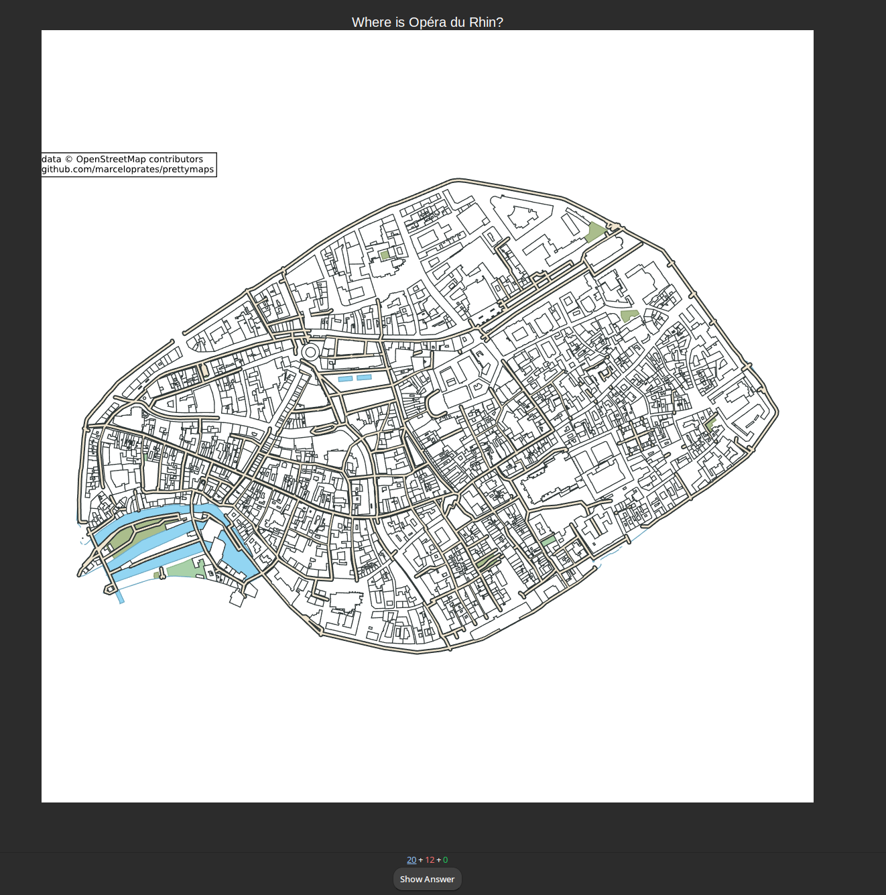
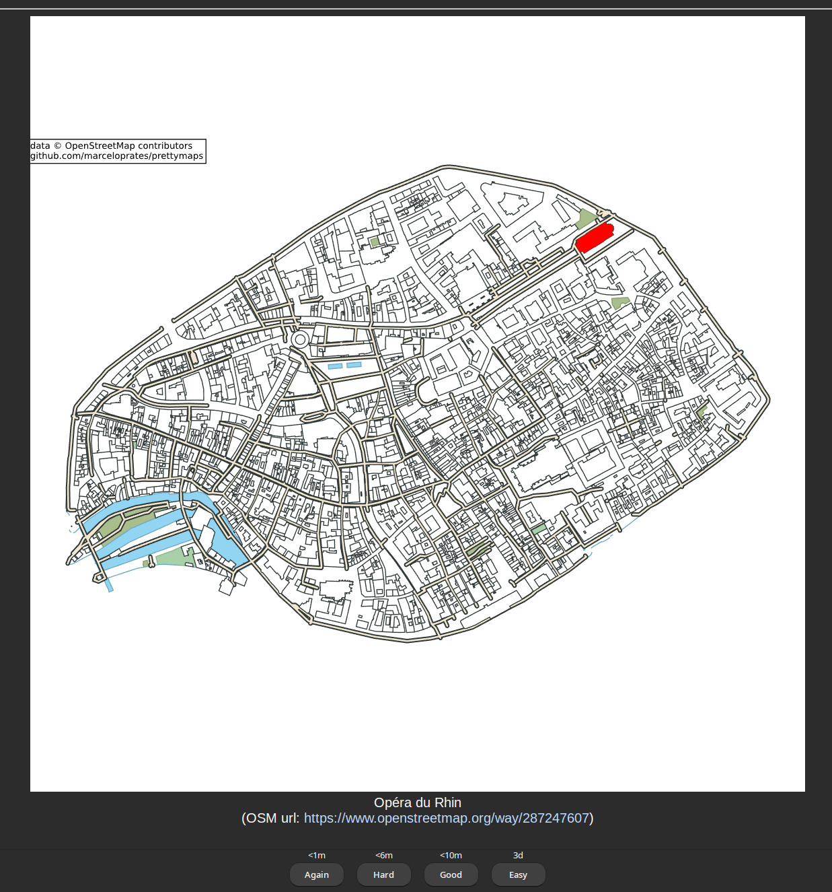
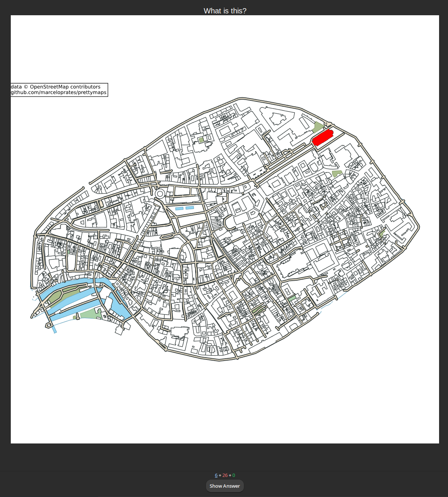

# OpenStreetMap Flashcards Generator

A [flashcard](https://en.wikipedia.org/wiki/Flashcard) generator based on
[OpenStreetMap](https://wiki.osmfoundation.org/wiki/Main_Page) data.

Will someday double as an [Anki](https://apps.ankiweb.net/) plugin, if I don't
get distracted before that.

## Usage

Invoke `osmfc.py` to generate an Anki deck file with proof-of-concept
flashcards:

```console
$ ./osmfc.py -v "Strasbourg grande ile"
[...some expected warnings from prettymaps...]
INFO:root:Found 16 features matching the given tags
[...some expected warnings from prettymaps...]
INFO:root:Created a note for OSM feature W26306273: "Hôtel de Ville""
INFO:root:Created a note for OSM feature W30922600: "Église Saint-Étienne""
INFO:root:Created a note for OSM feature W39224041: "Aubette""
INFO:root:Created a note for OSM feature W39540475: "Église protestante Saint-Pierre-le-Jeune""
INFO:root:Created a note for OSM feature W39550485: "Maison Spach""
INFO:root:Created a note for OSM feature W39605815: "Hôtel des Deux Ponts""
INFO:root:Created a note for OSM feature W39609222: "Hôtel de la Préfecture""
INFO:root:Created a note for OSM feature W39611079: "Hôtel de Dartein""
INFO:root:Created a note for OSM feature W39643856: "Maison Saré""
INFO:root:Created a note for OSM feature W39656819: "Foyer de l'Etudiant Catholique""
INFO:root:Created a note for OSM feature W39907377: "Ancienne douane""
INFO:root:Created a note for OSM feature W39971183: "Chambre de Commerce et d'Industrie""
INFO:root:Created a note for OSM feature W39973703: "Église protestante Saint-Thomas""
INFO:root:Created a note for OSM feature W287247607: "Opéra du Rhin""
INFO:root:Created a note for OSM feature R3575: "Palais Rohan""
INFO:root:Created a note for OSM feature R3541088: "Cathédrale Notre-Dame""
INFO:root:attaching files: []
INFO:root:Wrote a deck of 32 cards (in 16 notes) to output.apkg
```

In its current proof-of-concept state, the tool only builds anki cards for the
given area's buildings that are protected on a national level (OSM features with
`heritage=2`). For each of these, it create two cards: one asking the user where
the building is on a map of the area, and one showing the same map with the
building highlighted and asking what its name is.

| "Strasbourg grande ile" | Question | Answer |
| ----------------------- | -------- | ------ |
| Where is [...]? |  |  |
| What is this? |  |  |

## TODO

- try reduce space usage by rasterizing most of the map and keeping only the
  highlighted features as SVG
- make the code more testable
- allow zooming on the feature with a single click
- build cards for some "obvious" object types like streets (warning: some are
  split into multiple ways);
- build PDF cards;
- make it a proper Python package;
- make it an anki plugin (while still supporting stand-alone use);
- build cards according to custom user queries;

Libraries used:

- OSM querying and tile rendering: <https://github.com/marceloprates/prettymaps>
  and <https://geopandas.org>
- SVG manipulation: <https://lxml.de/>
- Anki deck generation: <https://github.com/kerrickstaley/genanki>
